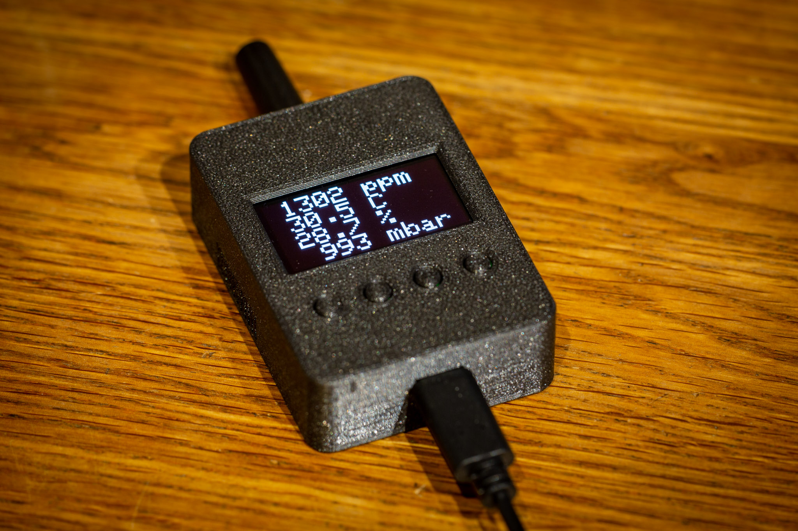
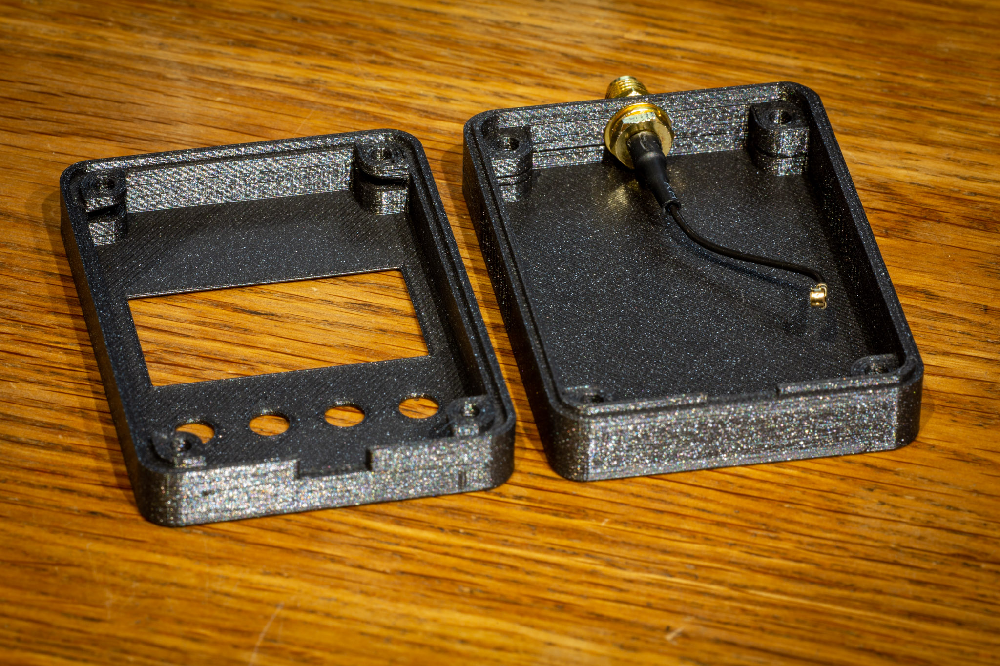
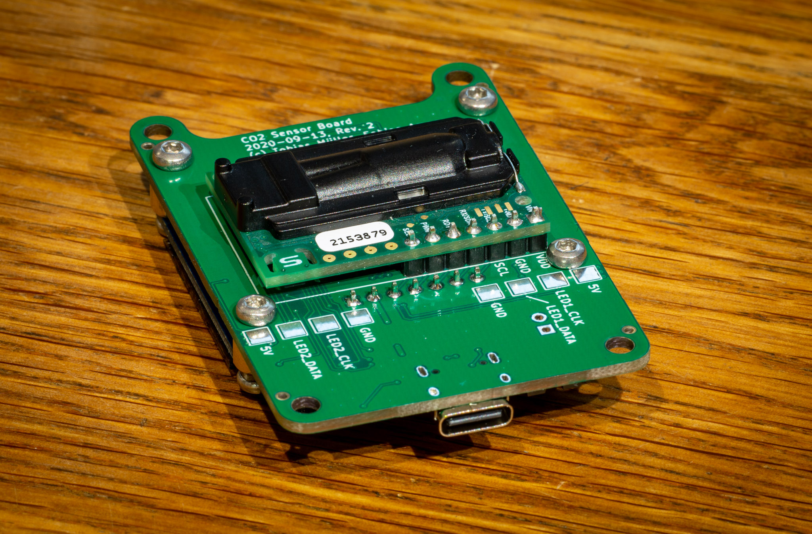
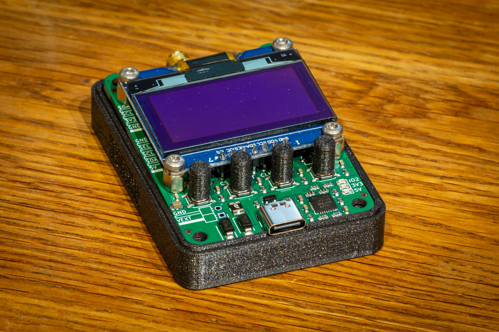

Co2-Sensor-Hardware
===

This repository is the hoftware part of the software project https://github.com/twam/Co2-Sensor-Software.

### Images

### JLCPCB

PCBs can be ordered almost fully-assembled from [JLCPCB](https://jlcpcb.com/DDE). Required files are
[Co2-Sensor_bom_jlc.csv](Gerber/Co2-Sensor_bom_jlc.csv), [Co2-Sensor_cpl_jlc.csv](Gerber/Co2-Sensor_cpl_jlc.csv) and
[Co2-Sensor.zip](Co2-Sensor.zip). Components missing are
* Co2 Sensor (J2)
* USB connector (J5) – can be also populated in the mean time, but is not included in production files, yet.

## License

[![CC BY-SA 4.0][cc-by-sa-shield]][cc-by-sa]

This work is licensed under a [Creative Commons Attribution-NonCommercial-ShareAlike 4.0 International License][cc-by-sa].

[![CC BY-SA 4.0][cc-by-sa-image]][cc-by-sa]

[cc-by-sa]: http://creativecommons.org/licenses/by-nc-sa/4.0/
[cc-by-sa-image]: https://licensebuttons.net/l/by-nc-sa/4.0/88x31.png
[cc-by-sa-shield]: https://img.shields.io/badge/License-CC%20BY--NC--SA%204.0-lightgrey.svg
